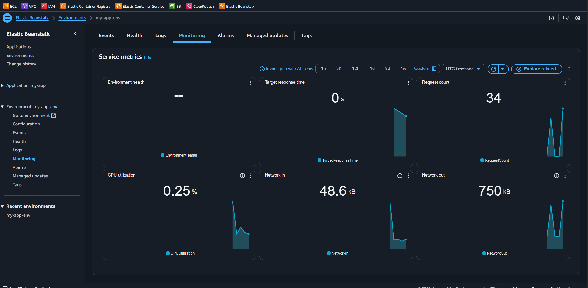

1. Створення застосунку в Elastic Beanstalk

Відкрити AWS Elastic Beanstalk → Applications.

2. Налаштування середовища

Відкрити Elastic Beanstalk → Configuration → Capacity

- Тип середовища: Web server environment
- EC2 Instance type: t3.micro

 

3. Моніторинг і логування

Відкрити Elastic Beanstalk → Monitoring, відображаються метрики:

- CPUUtilization
- RequestCount
- Target response time

4. Налаштування масштабування

Відкрити Elastic Beanstalk → Configuration → Scaling

- Min instances: 1
- Max instances: 3
- Scaling trigger: CPUUtilization > 70%

5. Перевірку доступу до застосунку

Відкрити згенерований Elastic Beanstalk URL у браузері.

6. Stress test

Запуск:

Моніторінг:

Сповіщення:

AutoScaling:

